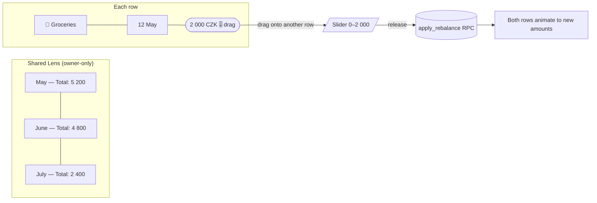

# BUDG-022 — FEAT | Shared Redistribution

> **Status:** Design / pre-implementation
> **Depends on:** [[BUDG-021]] (`is_shared` flag, share_links, `/share/:slug`)
> **Owner-only feature:** affordances visible **only to the authenticated owner** of the shared bag — never to public visitors of `/share/:slug`, never to other authenticated users.

## Goal

Let the owner *redistribute* money between their own `is_shared = true` events without leaving the budgeting app — quickly, by sliding amounts from one row to another. The public share page stays read-only.

## In scope

1. **Same-month transfer** — move N currency from one shared planned tx to another shared planned tx in the same month.
2. **Cross-month transfer** — push N from a shared event in month *M* into a (new or existing) shared event in month *M+k*.
3. **Recurring → one-off override** — pull N off a single occurrence of a shared recurring rule and place it on a separate shared event (uses `recurring_overrides`).
4. **Quick-add new shared event** — create a new `is_shared = true` planned tx straight from the redistribute view.

## Out of scope

- Public viewers writing back. `/share/:slug` stays anon-readable, no auth.
- Affecting non-shared transactions. Redistribution is a closed loop within the shared subset.
- Multi-user shared edits. There's still only one owner per share link.

## Plan / Design

- [[BUDG-022 - Plan|Implementation Plan]]
- [[BUDG-022 - ADR-001 - Shared redistribution lives in owner app, not public page|ADR-001]]
- [[BUDG-022 - ADR-002 - Drag-and-drop slider as primary UX|ADR-002]]
- [[BUDG-022 - ADR-003 - Reuse rebalance machinery, no new RPC|ADR-003]] *(superseded by ADR-004)*
- [[BUDG-022 - ADR-004 - Dedicated redistribute_shared RPC|ADR-004]]

## Wireframes

See [[BUDG-022 - Plan]] §Wireframes (mermaid) for layout sketches.

## Wireframes (preview)

Full set with all 4 flows lives in [[BUDG-022 - Plan]] §Wireframes. Quick visual:

> If diagrams render as plain code blocks, enable Obsidian → Settings → Core plugins → **Mermaid** (on by default in recent versions).

## Implementation Log

- [[BUDG-022 - 2026-04-28 - phase1-shared-lens-scaffold|2026-04-28 — Phase 1: read-only Shared Lens scaffold landed]]
- [[BUDG-022 - 2026-04-28 - phase2-dnd-same-month|2026-04-28 — Phase 2: same-month DnD redistribute + new RPC (ADR-004 supersedes ADR-003)]]
- [[BUDG-022 - 2026-04-28 - phase3-cross-month-and-dropzones|2026-04-28 — Phase 3: cross-month + drop-on-empty-zone "+ new shared event"]]
- [[BUDG-022 - 2026-04-28 - phase4-recurring-overrides|2026-04-28 — Phase 4: recurring sources via single-occurrence overrides]]
- [[BUDG-022 - 2026-04-28 - phase6-quickadd-shared-event|2026-04-28 — Phase 6: standalone "+ Add shared event" (expense-only, optional category)]]
- [[BUDG-022 - 2026-04-28 - phase5-mobile-long-press|2026-04-28 — Phase 5: long-press → picker mode for touch devices]]

## Related

- [[BUDG-021]] — base sharing surface this builds on
- [[BUDG-012]] — Monthly Goal & Rebalance flow (the underlying `apply_rebalance` RPC is reusable)
