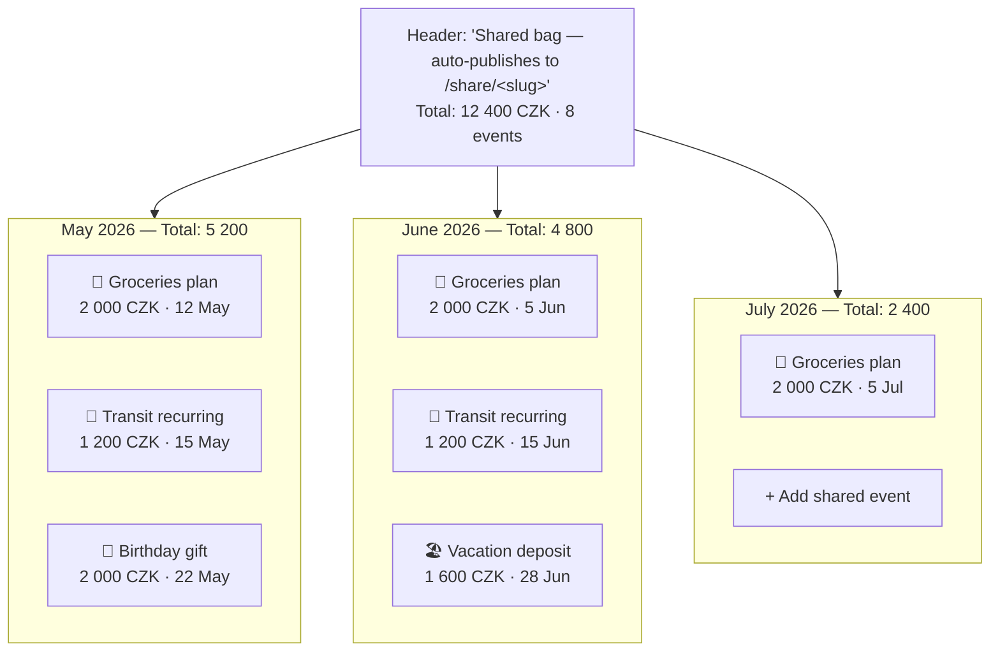
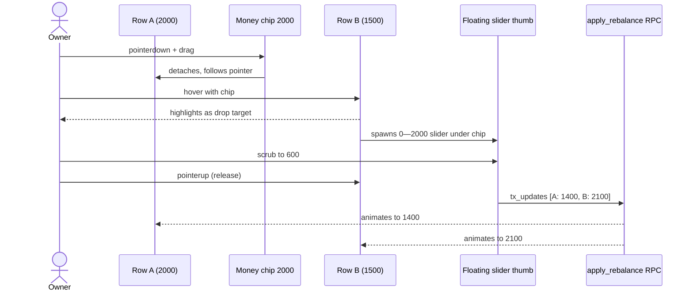
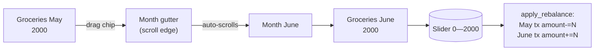
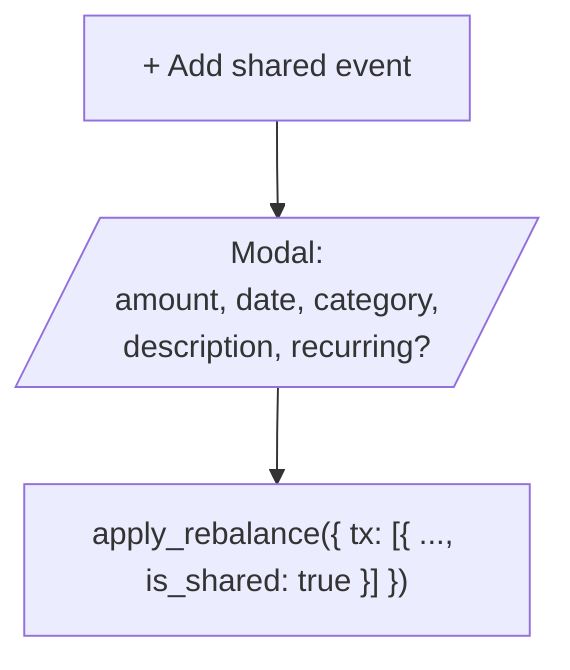

# BUDG-022 - Plan

*Part of [[BUDG-022]]*

## Intent

Add a **Shared Lens** (owner-only) to the budgeting PWA where the owner sees their `is_shared = true` events grouped by month and can redistribute money between rows by drag-and-drop. The public `/share/:slug` page stays untouched.

## Wireframes

### Lens layout (desktop ≥ 768px)



Each row carries:
- Category icon + name + occurrence date.
- A **draggable money chip** on the right (the amount).
- A subtle "recurring" tag if the row is an expanded recurring occurrence.
- An overflow `…` menu for keyboard/long-press fallback (Redistribute, Edit, Unshare).

### Drag interaction (zoom-in on one month)



Mobile: long-press a chip → bottom sheet with "Move from <src> to …" target picker → same slider on the sheet.

### Cross-month transfer



If there's no matching target row in the destination month, the gutter shows a **"+ create new shared event here"** drop zone that opens the quick-add modal pre-filled with the dragged amount.

### Recurring → one-off

```mermaid
flowchart LR
    Occ["Transit recurring<br/>15 May · 1200"] -- drag chip --> NewRow["+ new shared event<br/>(empty drop zone)"]
    NewRow --> QuickAdd["Quick-add modal<br/>(pre-filled amount: e.g. 300)"]
    QuickAdd --> Commit["apply_rebalance:<br/>overrides: [&#123;rule: transit, date: 15 May, amount_override: 900&#125;]<br/>tx: [&#123;new shared one-off 300&#125;]"]
```



Slider's max for a recurring source = the rule's normal amount for that occurrence. Releasing on a brand-new drop zone always opens the quick-add modal.

### Quick-add (no drag — just an "+" button)



Same modal as the existing AddTransactionDialog but with `is_shared` locked to `true` and a hint banner "This event will appear on your public share page."

## Phases

### Phase 1 — Owner-only Shared lens scaffold

- New route lens `pages/lenses/SharedLens.tsx` (sibling of TodayLens etc.).
- Add to lens nav (`Layout.tsx` / wherever lenses are listed). Visible only to authenticated users.
- Hook `useSharedBag()` — selects all `is_shared = true` transactions plus expands `is_shared = true` active recurring rules into the next 6 months. Reuses `expandRuleInRange` like PublicShare.
- Render months with totals + draggable rows. Read-only first cut (no DnD yet) — verifies the data shape matches the public page exactly.

### Phase 2 — Drag-and-drop transfer (same month)

- Make the amount chip on each row a `framer-motion` `motion.div` with `drag`.
- `onDragStart` snapshot the source row + amount.
- `onDragEnter` of another row → render a `Slider` element (vanilla `<input type="range">`, styled) below the chip.
- `onDragEnd` (release) → assemble payload:

  ```ts
  apply_rebalance({
    tx_updates: [
      { id: src.id, amount: src.amount - n },
      { id: dst.id, amount: dst.amount + n },
    ],
    tx: [],
    overrides: [],
  })
  ```

- Mutation invalidates `['shared_bag']` query.

### Phase 3 — Cross-month + drop on empty zone

- Auto-scroll month list while dragging near top/bottom edges.
- Add an empty drop-zone "+ create new shared event in {month}" between months.
- Releasing on the empty zone opens the quick-add modal pre-filled with the dragged amount and the destination month's first day.

### Phase 4 — Recurring → one-off override

- When `src` is a recurring occurrence, the slider scrubs `0 .. originalAmount`.
- On commit, payload uses `overrides: [{ recurring_rule_id, occurrence_date, amount_override: original - n }]` instead of `tx_updates`. The +n side is whatever rule applies to the destination row.
- If destination is also a recurring occurrence, both sides take the override route.

### Phase 5 — Mobile fallback (long-press + bottom sheet)

- `usePointerLongPress` hook on the row chip. Long-press → bottom sheet:
  - "Move from <src>" header.
  - Searchable list of shared events grouped by month.
  - Same slider once a target is picked.
  - Same commit path.

### Phase 6 — Quick-add shared event button per month

- "+ Add shared event" tile in each month section.
- Opens `AddTransactionDialog` with `initialIsShared = true` and locked.
- Hint text "This event will be visible on your public share page."

### Phase 7 — Polish & verify

- Optimistic updates for snappy feel.
- Toast on success: "Moved 600 CZK from <src> to <dst>". *(No Undo button — see Open questions.)*
- Visual diff highlight on rows that just changed (green for + and red for −, fade out over 2s).
- Double-check `/share/:slug` reflects changes after a refresh (no client cache divergence).

## Open questions

*(All resolved 2026-04-28.)*

- **Categories on quick-add** — *optional.* The modal exposes the category picker but doesn't require a value.
- **Undo** — *not implementing.* Reversing a redistribute by dragging back is a single gesture; persistent undo stack is YAGNI for v1. Toast just says "Moved N from … to …" with no Undo button.
- **Recurring source split** — *always single occurrence.* Pulling N off 15 May only writes a `recurring_overrides` row for that date; future occurrences keep the rule's normal amount. No "apply to all future" affordance.

## Acceptance criteria

- Authenticated owner sees a Shared lens with all their shared events grouped by month.
- Dragging a chip onto another shared row in the same month transfers any 0..src.amount via a slider; both rows update; `/share/:slug` shows the new amounts after reload.
- Dragging onto a row in a different month works the same way.
- Dragging onto an empty drop zone opens a pre-filled quick-add modal.
- Dragging from a recurring occurrence writes a `recurring_overrides` row instead of mutating the rule.
- Mobile users without DnD support get the long-press → sheet flow with identical results.
- Non-owners (incognito visitors of `/share/:slug`, other authenticated users) see no edit affordances anywhere.
- Every redistribute call goes through `apply_rebalance` — atomic, reversible by inverse call.
